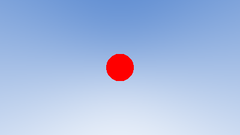

# Tracerola

Tracerola is a little ray tracer that I will be building as I work through Gabriel Gambetta's book *Computer Graphics from Scratch: A Programmer's Introduction to 3D Rendering*. The code that is presented here is a direct implementation of the mathematical models presented within in the book. The book is completely language-agnostic, so I have taken the help of a few guides to build my utility headers and helper functions.

This is a work in progress which I will keep updating as I keep making progress with it. I also plan on eventually showing all the mathematical work and proofs that it took to make this.

## Progress
#### First spherical object with background gradient

